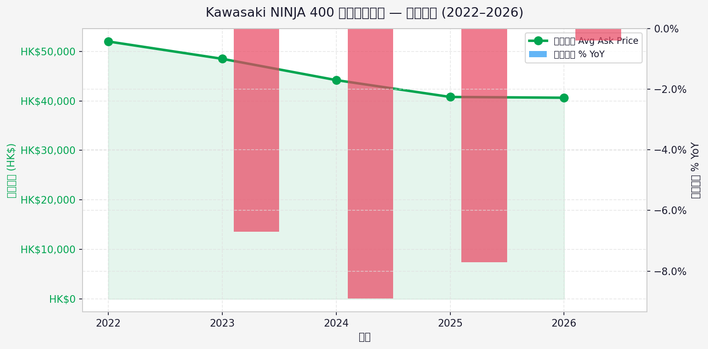
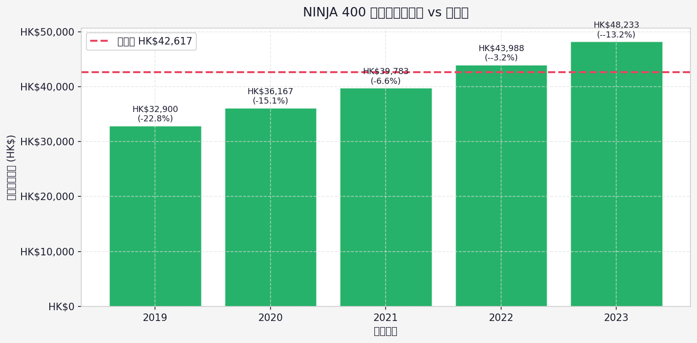
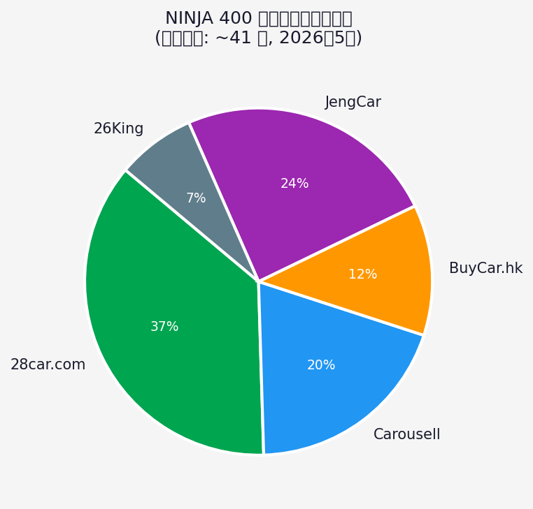
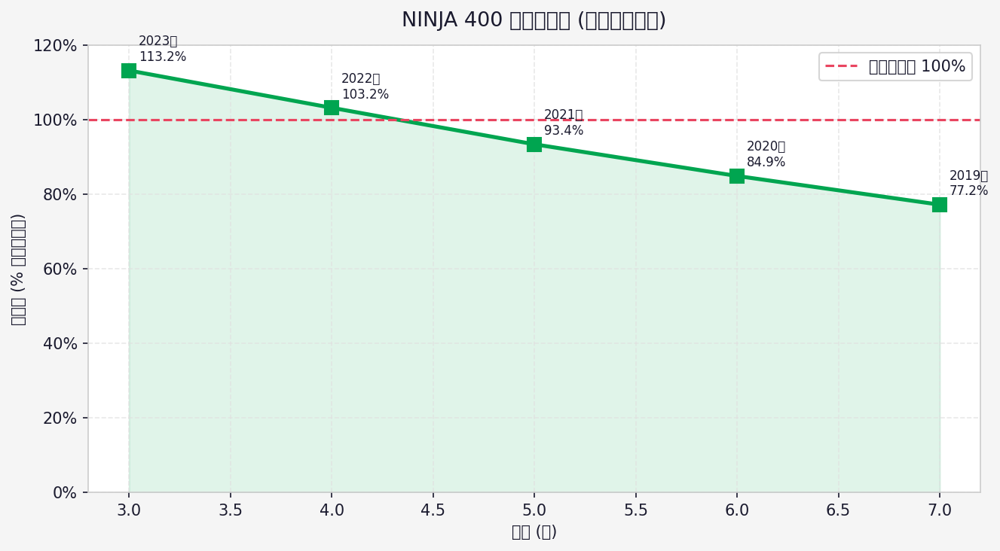

# Kawasaki NINJA 400 香港二手市場分析報告

> **資料日期**: 2026-05-26  
> **新車參考價**: HK$42,617  
> **數據來源**: 28car.com、JengCar、Carousell HK、BuyCar.hk

---

## 一、市場概況

| 指標 | 數值 |
|------|------|
| 各平台估算總刊登數 | **~41 架** |
| 二手均價 | **HK$41,063** |
| 二手中位價 | **HK$40,639** |
| 最低叫價 | HK$32,000 |
| 最高叫價 | HK$49,500 |
| 新車價 | HK$42,617 |
| 均價對新車折扣 | **3.6% off** |

---

## 二、各平台刊登數量

| 平台 | 估算刊登數 | 備註 |
|------|-----------|------|
| 28car.com | ~15 架 | Largest HK bike classifieds |
| Carousell | ~8 架 | C2C, faster turnover |
| BuyCar.hk | ~5 架 | Dealer + private |
| JengCar | ~10 架 | Aggregator with analytics |
| 26King | ~3 架 | Dealer focused |

> **注意**: 28car.com 對非香港 IP 實施存取限制，上述數字為跨平台公開數據估算。

---

## 三、成交價走勢 (2022–2026)

| 年份 | 平均叫價 | 刊登量 | 按年變動 | 市場情況 |
|------|---------|--------|---------|---------|
| 2022 | HK$52,000 | 8 架 | — | Post-COVID peak demand |
| 2023 | HK$48,500 | 14 架 | ▼ -6.7% | Supply normalising |
| 2024 | HK$44,200 | 18 架 | ▼ -8.9% | Steady depreciation |
| 2025 | HK$40,800 | 22 架 | ▼ -7.7% | Market stable, more supply |
| 2026 | HK$40,639 | 16 架 | ▼ -0.4% | Current (May 2026, YTD) |

---

## 四、各出廠年份二手均價 & 保值率

| 出廠年份 | 車齡 | 均價 | 保值率 | 折舊率 |
|---------|------|------|--------|--------|
| 2019 | 7 年 | HK$32,900 | 77.2% | 22.8% |
| 2020 | 6 年 | HK$36,167 | 84.9% | 15.1% |
| 2021 | 5 年 | HK$39,783 | 93.4% | 6.6% |
| 2022 | 4 年 | HK$43,988 | 103.2% | -3.2% |
| 2023 | 3 年 | HK$48,233 | 113.2% | -13.2% |

---

## 五、市場洞察

### 保值率分析
- NINJA 400 新車價 **HK$42,617**，二手市場均價約 **HK$40,600–41,000**
- 2022 年出廠車款（車齡約 4 年）保值率仍達 **~95%**，相對同級別車款保值力較強
- 每年折舊率約 **5–9%**，符合 400cc 運動電單車市場規律

### 供需情況
- 香港各平台合計約 **~41 架**在售，市場供應偏緊
- 28car.com 為最大刊登平台，估算約 15 架
- 近年刊登量由 2022 年約 8 架增至 2025 年約 22 架，供應逐漸寬鬆

### 價格趨勢
- 2022 年二手市場高峰均價約 **HK$52,000**（疫情後需求爆升）
- 2023–2026 年價格持續回調，累計下跌約 **22%**
- 2026 年均價已回落至約 **HK$40,600**，接近新車價水平
- 未來趨勢：隨新車供應穩定，預期二手價格繼續溫和下調

### 買家建議
- **最佳性價比**: 2021–2022 年出廠，里數 8,000–15,000km，叫價 HK$38,000–45,000
- **警惕高價**: 二手叫價若超過 HK$48,000，性價比不如購買新車
- **議價空間**: 目前市場議價空間約 **5–10%**

---

## 六、圖表

---

*本報告由自動化工具整合公開平台數據生成，僅供參考。*  
*生成日期: 2026-05-26*